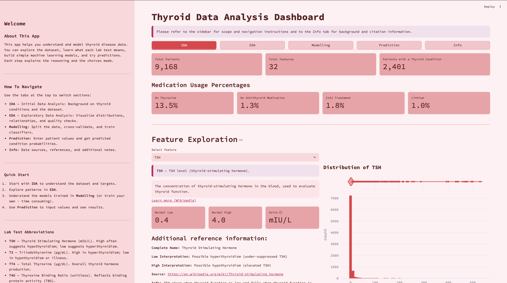
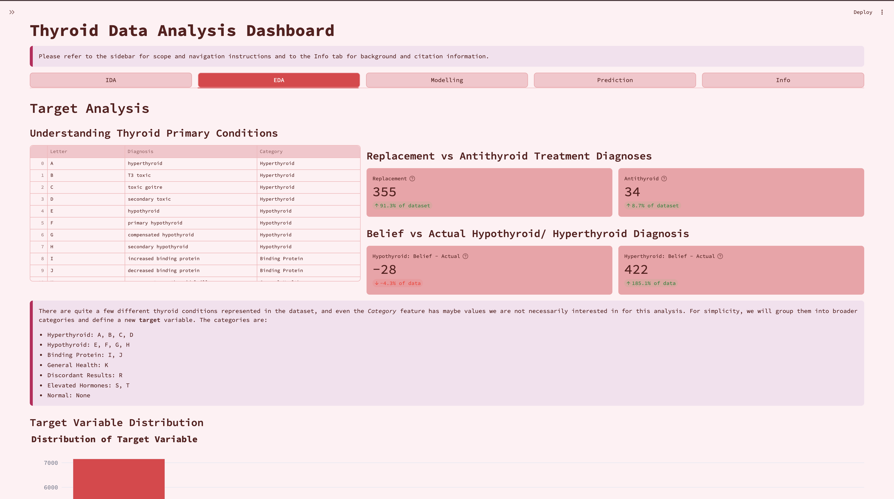
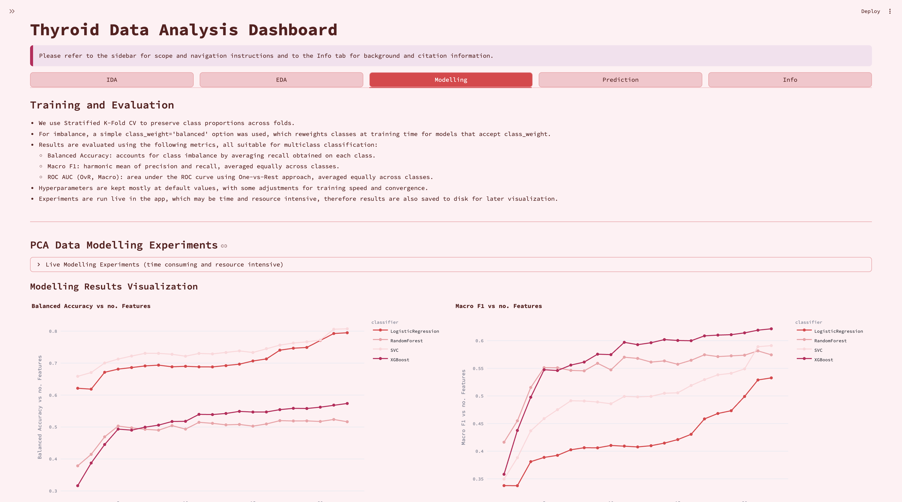
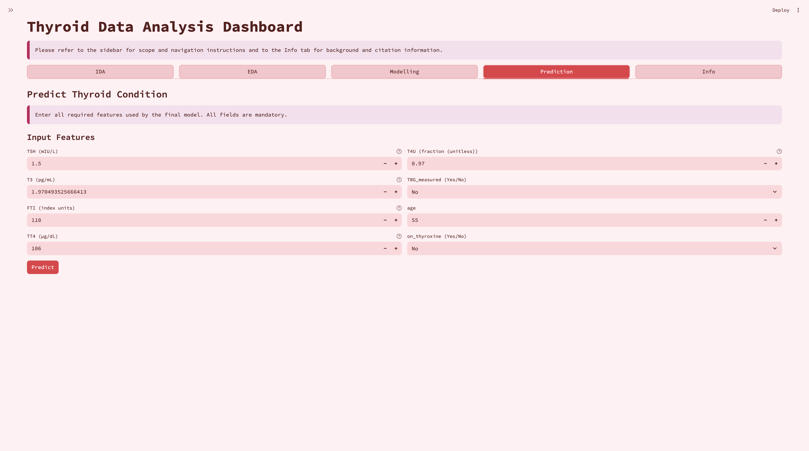

# Thyroid Data Analysis Dashboard

Streamlit application and supporting notebooks that explore, model, and interact with the UCI **Thyroid Disease** dataset. The project blends careful data preparation with interactive visualisations and a patient-style prediction form aimed at understanding common thyroid conditions.

## Overview
- Cleaned, harmonized, and documented variant of the most extensive thyroid dataset published by Quinlan (1986).
- Guided workflow that walks from Initial Data Analysis (IDA) through to live predictions.
- Emphasis on transparency: every modelling choice is summarised in the UI and persisted artifacts are saved for reuse.

## Application Walkthrough
### Initial Data Analysis (IDA)
- Inspect overall dataset dimensions, medication usage rates, and highlight potential outliers.
- Analyse missingness patterns with Plotly heatmaps and interactive sampling.
- Compare imputation strategies (KNN, MICE, mean, median) while tracking correlation drift across thyroid hormones.

### Exploratory Data Analysis (EDA)
- Review simplified target classes and diagnostic groupings with labelled bar charts.
- Explore multivariate relationships via scatter, violin, and correlation plots with interactive grouping choices.
- Rank features using tree-based importances and mutual information, then visualize PCA projections.

### Modelling
- Run configurable experiments across Logistic Regression, Random Forest, SVC, and XGBoost.
- Perform train/test split prior to 5-fold Stratified CV and capture balanced accuracy, macro F1, and ROC AUC.
- Persist the best-performing Random Forest model (`models/best_rf_selected8.joblib`) and visualize a labelled confusion matrix with hover counts and feature importances.

### Prediction
- Collect patient-style inputs with unit-aware controls and normal reference ranges sourced from `lab_reference_intervals.csv`.
- Encode boolean flags as Yes/No selectors and reassemble the feature vector expected by the saved model.
- Present human-readable class labels alongside probability distributions for decision support (prototype only).

### Info
- Summarizes workflow decisions, preprocessing highlights, and references with quick links back to the README and external resources.

## Data Pipeline Highlights
- **Diagnosis parsing:** Split raw diagnosis strings into primary/secondary codes and generate patient identifiers.
- **Boolean harmonisation:** Convert `t/f` flags to boolean and later to numeric encodings for modelling.
- **Outlier handling:** Flag improbable ages (>100) and note their removal during cleaning.
- **Advanced imputation:** Evaluate KNN, Iterative (MICE), mean, and median imputers, choosing the method with the smallest correlation shift.
- **Feature safety:** Remove leakage-prone columns (diagnosis codes, referral source, measured flags) before encoding.
- **Session persistence:** Cache encoded data, selected features, and imputation choices across Streamlit tabs.

## Modelling Summary
- **Best model:** Random Forest with approximately eight manually selected features.
- **Validation:** 5-fold Stratified CV on the training split; held-out test set for final evaluation.
- **Indicative metrics:** Balanced Accuracy ≈ 0.75, Macro F1 ≈ 0.73, Macro ROC AUC ≈ 0.82.
- **Explainability aids:** Feature importance bar charts and probability-calibrated confusion matrices with hover tooltips.

## Prediction Experience
- Input forms pre-populate with medians, provide lab ranges, and map boolean choices to numerical values automatically.
- The returned class label is mapped via `data/target_encoding.csv`, ensuring human-readable output.
- Probability bars help gauge model confidence; results are flagged as educational rather than diagnostic.

## Technology Stack
- **Python 3.11+**, **Streamlit**, **Plotly**, **pandas**, **scikit-learn**, **XGBoost**, **joblib**.
- Styling via custom CSS (`assets/style.css`) and a bespoke Plotly colour palette (`source/config.py`).

## Getting Started (Local)
```bash
# 1. Create and activate a virtual environment
python -m venv .venv
source .venv/bin/activate  # On Windows use: .venv\Scripts\activate

# 2. Install dependencies
pip install -r requirements.txt

# 3. Launch the Streamlit app
streamlit run app.py
```

## Repository Layout
- `app.py` – Streamlit entrypoint configuring tabs and loading datasets.
- `source/` – reusable modules: sidebar content, tab logic, configuration, and plotting helpers.
- `data/` – cleaned datasets, lab reference ranges, condition codes, modelling results, and saved encodings.
- `models/` – persisted estimators (e.g., `best_rf_selected8.joblib`).
- `screenshots/` – imagery for documentation (add fresh captures as the UI evolves).
- `assets/` & `.streamlit/` – static styling and app configuration.

## Deployment
- Live demo: [Streamlit Cloud](https://juliab-thyroid-data-analysis.streamlit.app/)

## Screenshots
Update these paths with the latest captures (add images under `screenshots/`).

| Section | Preview |
| --- | --- |
| IDA Tab |  |
| EDA Tab |  |
| Modelling Tab |  |
| Prediction Tab |  |

## Dataset Citation
```bibtex
@misc{thyroid_disease_102,
  author       = {Quinlan, Ross},
  title        = {{Thyroid Disease}},
  year         = {1986},
  howpublished = {UCI Machine Learning Repository},
  note         = {{DOI}: https://doi.org/10.24432/C5D010}
}
```

## License
MIT — see `LICENSE` for details.